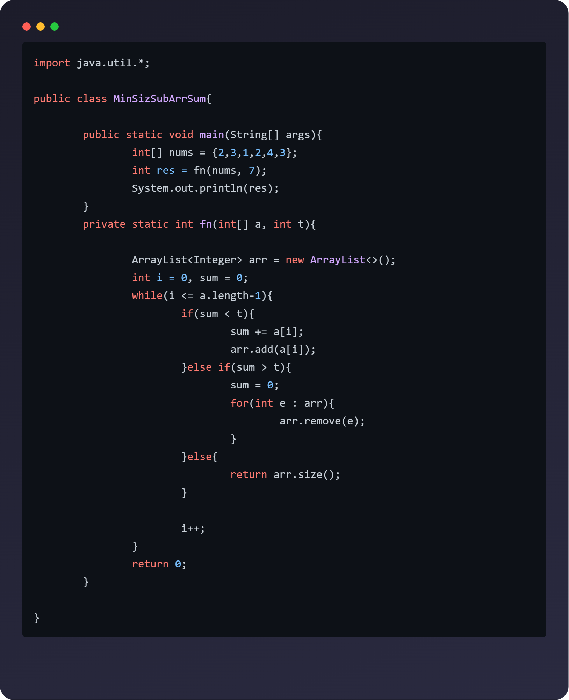

# Screenshotify

**Screenshotify** is a Visual Studio Code extension that lets you create beautiful screenshots of your code snippets directly from the editor—perfect for sharing on social media or in presentations.

---

## 🚀 Features

- **One-click code screenshots**: Select code and run the command to open a screenshot preview.
- **Aspect ratio presets**: Choose from Twitter, Instagram, LinkedIn, and Square formats.
- **Modern, stylish UI**: Mac-style window chrome, rounded corners, and syntax highlighting.
- **Download as PNG**: Instantly save your code screenshot to your computer.
- **Automatic language detection**: Syntax highlighting matches your code.

---

## 🛠️ Usage

1. **Select the code** you want to screenshot in your editor.
2. Open the Command Palette (`Ctrl+Shift+P` or `Cmd+Shift+P`).
3. Run `Screenshotify: Take Screenshot`.
4. Choose your preferred aspect ratio.
5. Preview and download your screenshot as a PNG.

---

## 📽️ Demo Video

https://github.com/user-attachments/assets/b4c46771-c0e2-4c85-938d-460b83568d35

---

## ⚙️ Requirements

- Visual Studio Code v1.101.0 or higher.

No additional dependencies are required.

---

## ⚡ Extension Settings

This extension does **not** add any custom settings at this time.

---

## 🐞 Known Issues

- Some themes or unusual code fonts may not render exactly as in your editor.
- Large code selections may cause the screenshot preview to be slow.

Please [open an issue](https://github.com/DeadpoolX7/vscode-screenshotify/issues) if you encounter any problems.

---

## 📦 Release Notes

### 0.0.1

- Initial release: Take and download beautiful code screenshots with aspect ratio presets.

---

## 🙌 Contributing

Pull requests and feature suggestions are welcome!  
See [CONTRIBUTING.md](CONTRIBUTING.md) for guidelines.

---

## 📄 License

[MIT](LICENSE)

---

## 📚 More Information

- [VS Code Extension Guidelines](https://code.visualstudio.com/api/references/extension-guidelines)
- [Marketplace Publishing Guide](https://code.visualstudio.com/api/working-with-extensions/publishing-extension)

---

**Enjoy using Screenshotify! Share your code in style.**
